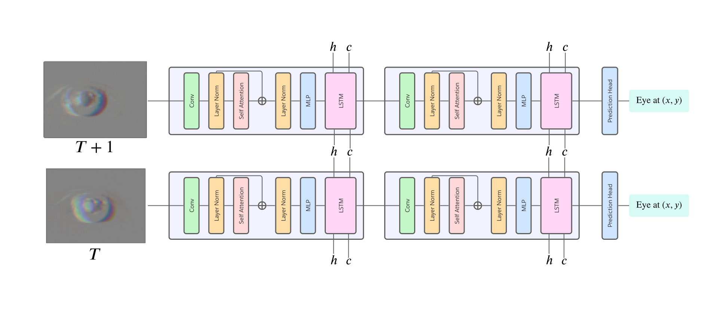

# [Event-based eye Tracking Challenge Submission](https://EETChallenge.github.io/EET.github.io/) \ Using an efficient version of Recurrent Vision Transformer

This is our submission to the Event-based eye Tracking challenge part of the CVPR 2024 Workshop [AI for Streaming](https://ai4streaming-workshop.github.io/).


## About the Challenge
Developing an event-based eye-tracking system presents significant opportunities in diverse fields, notably in consumer electronics and neuroscience. Human eyes exhibit rapid movements, occasionally surpassing speeds of 300°/s. This necessitates using [event cameras](https://www.youtube.com/watch?v=6xOmo7Ikwzk&t=80s&ab_channel=Sony-Global) capable of high-speed sampling and tracking. 

In consumer electronics, particularly in augmented and virtual reality (AR/VR) applications, the primary benefits of event-based systems extend beyond their high speed. Their highly sparse input data streams can be exploited to reduce power consumption. This is a pivotal advantage in creating lighter, more efficient wearable headsets that offer prolonged usage and enhanced user comfort. 

This is instrumental in augmenting the immersive experience in AR/VR and expanding the capabilities of portable technology. In neuroscience and cognitive studies, such technology is crucial for deciphering the complexities of eye movement. It facilitates a deeper comprehension of visual attention processes and aids in diagnosing and understanding neurological disorders. 

This challenge aims to develop an **event-based eye-tracking system for precise tracking of rapid eye movements** to produce lighter and more comfortable devices for a better user experience. Simultaneously, it promises to provide novel insights into neuroscience and cognitive research, deepening our understanding of these domains.

## Our solution
We have been inspired by the Recurrent Vision Transformer model that demonstrated great performance in event-based object detection. Starting from the original architecture we have made modifications in order to better fit our task and performance requirements. Namely, changing the number of stages from four to only two and further simplifying the architecture to use Self Attention instead of a combination of Grid and Block attention modules.



## Results
We have demonstrated good performance on low memory requirements. Our model only needs `150k` parameters in order to achieve a `97.6%` p10 accuracy on the hidden dataset from [Kaggle](https://www.kaggle.com/competitions/event-based-eye-tracking-ais2024/leaderboard?).

| Model                | P10 Accuracy | Parameters | Total mult-adds | Inference speed (batch size 1) |
|----------------------|------------|------------|-----------------|--------------------------------|
| Efficient RVT 2 Layers | 97.6% | 149,570    | 36.96M          | 1.06ms (RTX 3060 Laptop GPU)                         |


## Website
We showcase how our model performs on the dataset in a visual way at our [website](https://rd211.github.io/ervt/).


## Running the model
The full model can be found in `model/RVT.py`. 

### Training a new model
Trains a new model and logs it with mlflow.
```bash
python train.py --config_file rvt.json
```
### Creating predictions
Creates predictions as a `submission.csv` file.
```bash
python test.py --config_file rvt.json --checkpoint <path_to_checkpoint>
```
### Benchmarking
We benchmark performance, inspect model size and parameter count.
```bash
python bench.py --config_file rvt.json --checkpoint <path_to_checkpoint>
```
### Note: In order to run any of the scripts make sure to use the provided `environment.yml` file.


### Pretrained weights
The pretrained weights can be found [here](https://drive.google.com/file/d/1Rp2aamFuw46laHZ1QHIE4W1nYwBJuKhI/view?usp=drive_link). Make sure to not modify the configuration as this might prevent the model from loading the weights correctly.
## References

```
@inproceedings{chen20233et,
  title={3et: Efficient Event-based Eye Tracking Using a Change-based Convlstm Network},
  author={Chen, Qinyu and Wang, Zuowen and Liu, Shih-Chii and Gao, Chang},
  booktitle={2023 IEEE Biomedical Circuits and Systems Conference (BioCAS)},
  pages={1--5},
  year={2023},
  organization={IEEE}
}

@misc{gehrig2023recurrent,
      title={Recurrent Vision Transformers for Object Detection with Event Cameras}, 
      author={Mathias Gehrig and Davide Scaramuzza},
      year={2023},
      eprint={2212.05598},
      archivePrefix={arXiv},
      primaryClass={cs.CV}
}
```